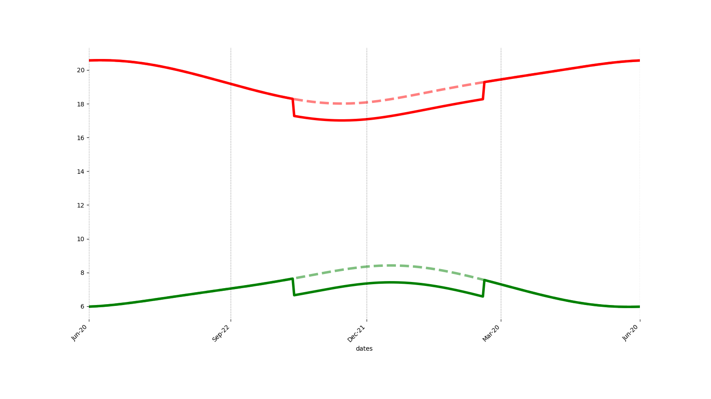
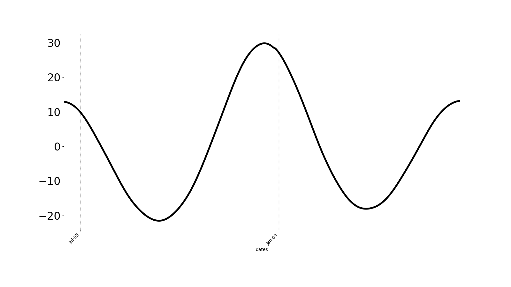

# longest_shortest_day

Evaluate sunrise and sunset each day for extremes including
the longest and shortest days based on sunrise sunset times
as well as solar day length.

# Length of Daylight
rise and set extremes with and without permanent daylight saving time, for Raleigh, NC

Observing daylight saving
* rise min 2025-06-12 5.96 (5:57:36 a.m.)
* rise max 2024-11-02 7.64 (7:38:16 a.m.)
* set  min 2024-12-05 17.01 (7:01:00 p.m.)
* set  max 2024-06-28 20.58 (8:34:48 p.m.)

permanent daylight saving
* rise min 2025-06-12 5.96 hours (5:57:36 a.m.)
* rise max 2025-01-06 8.42 hours (8:25:12 a.m.)
* set  min 2024-12-05 18.01 hours (6:00:36 p.m.)
* set  max 2024-06-28 20.58 hours (8:34:48 p.m.)

# Solar Day Length

As perihlion approaches on Jan 1, the Earth speeds up in its orbit around the Earth, 
which requires a little more time for the Earth to rotate to the same position relative to the Sun.

